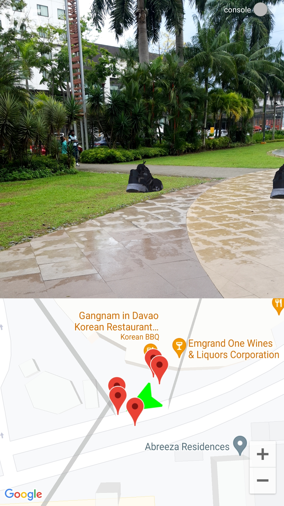
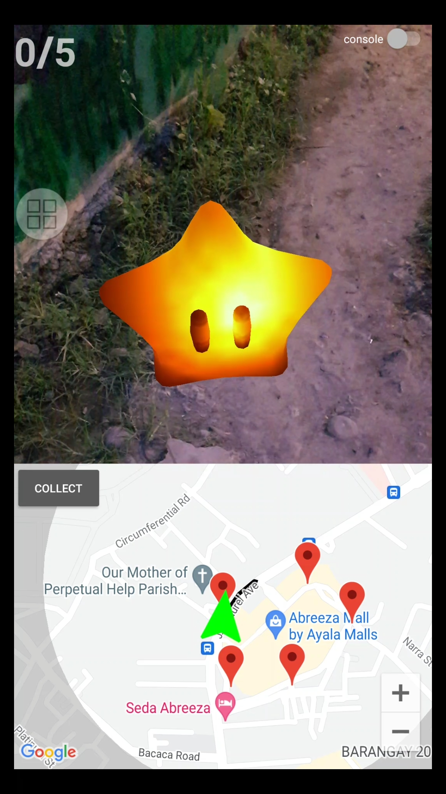
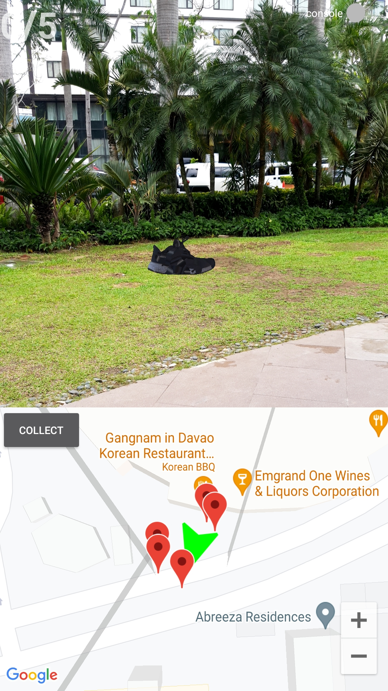
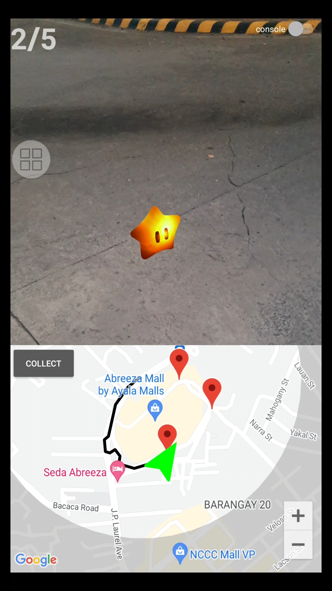
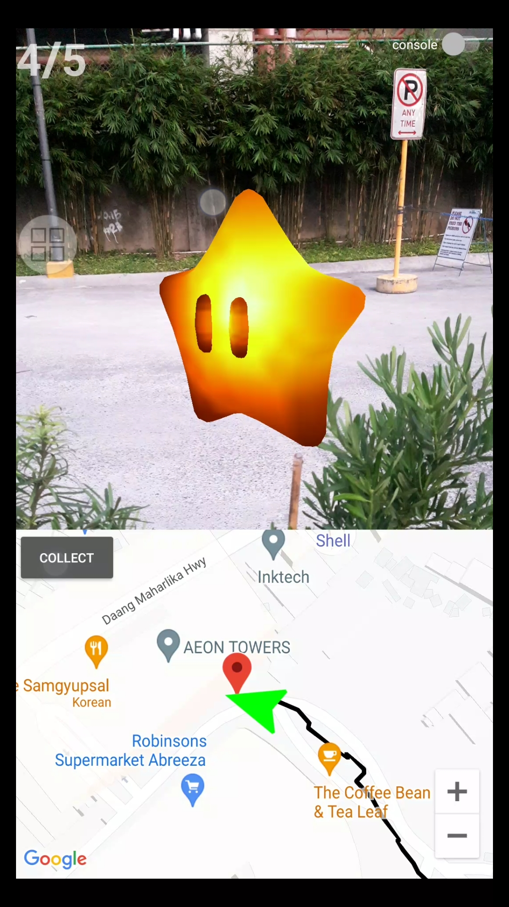
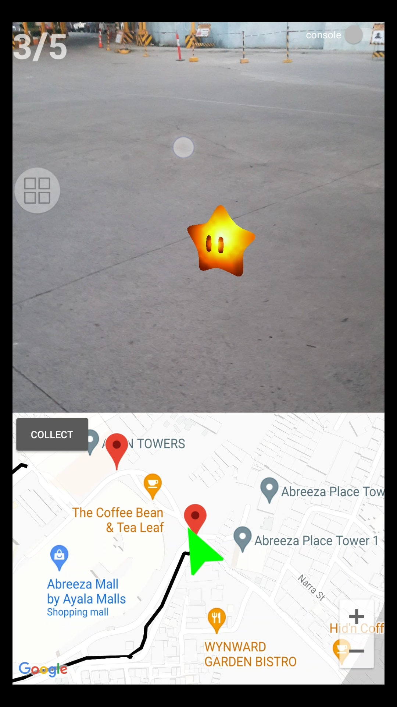

# Rundom
## An immersive scavenger hunt - running app

 
 
Rundom is a scavenger-running app powered by ARCore Geospatial API.

Simply choose a meter range, and Rundom randomly distributes object inside the bubble. Your goal as a runner is to collect all objects as fast as possible.
 
 

    
    
    
    
    
    

 
 

## Attributions
This repository contains a modified [ARCore Geospatial API Codelab](https://developers.google.com/ar/develop/geospatial/java/codelab#0) template.
- [Shoes 3D model](https://sketchfab.com/3d-models/nike-runner-scan-77c8d47e0b404810a3bddede4be801cb)
- [Star 3D model](https://sketchfab.com/3d-models/power-star-220d54fc3d34499ab1fda41ceed7d072)

## License

    Copyright 2021 Google LLC

    Licensed under the Apache License, Version 2.0 (the "License");
    you may not use this file except in compliance with the License.
    You may obtain a copy of the License at

        https://www.apache.org/licenses/LICENSE-2.0

    Unless required by applicable law or agreed to in writing, software
    distributed under the License is distributed on an "AS IS" BASIS,
    WITHOUT WARRANTIES OR CONDITIONS OF ANY KIND, either express or implied.
    See the License for the specific language governing permissions and
    limitations under the License.